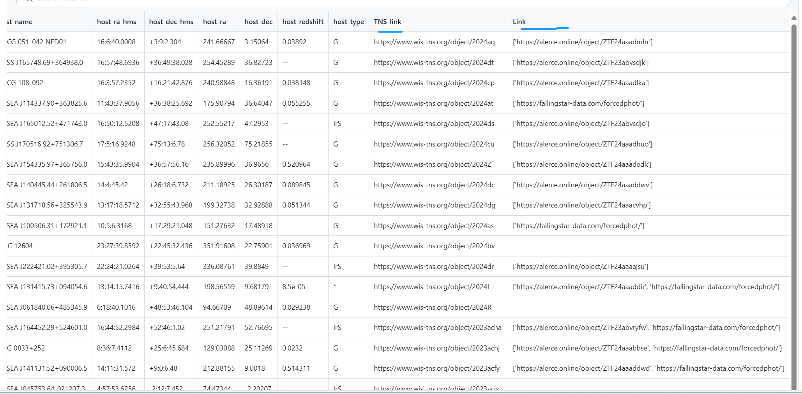
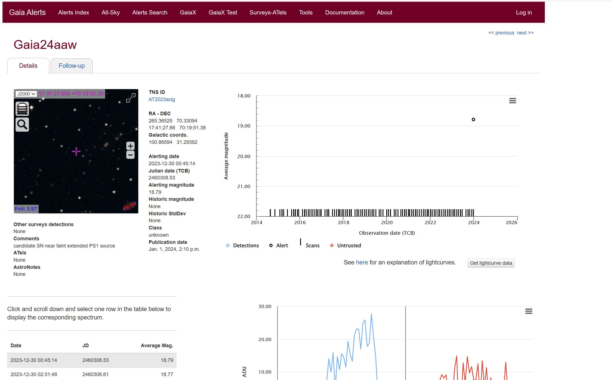

# This is a transient notes.

## Fun:

    Get every day TNS information from TNS,then filter by dec and mag,(dec>-20,unit:deree,mag<=18.8,unit:AB)

    next get 2 arcmin of TNS coordinates from NED to get host redshift,choose no. 1 as redshift from top 10.

    'full_name,values,tns_ra_hms,tns_dec_hms,tns_ra,tns_dec,discoverydate,discovery_mag,filter,location,redshift,type,internal_names,host_name,host_ra_hms,host_dec_hms,host_ra,host_dec,host_redshift,host_type,TNS_link,Link' be saved.

    -->ref

    ATname,values,tns_ra_hms,tns_dec_hms,transient_ra,transient_dec,discoverydate,discoverymag,filter,location,redshift,type,internal_names,host_name,host_ra_hms,host_dec_hms,host_ra,host_dec,host_redshift,host_type,TNS_link,Link.
    
    {$\textbf TNS_link,ZTF_link,you can copy,right to search links.$}
## update log:

    v2. set center condition as 1.8 asc,add galaxy type,impove ST file object sort.

    v3.imporved redshift from top 10 data.

    v4.solved some debug:cut mag,repoted data,wider redshift range,solve - dec bug.
    v5.add vlules,delete *.txt.

## dir:
    /TNS/TNS_ST/obs_csv:this is filtered transient every day.

    /TNS/TNS_ST/obs_plan:this is filtered transient obs plan every day.(now is wrong information,just ref)

## plan_link:
    http://www.xinglong-naoc.cn/staralt/

## 中文说明

### 候选源筛选

1. 查看/TNS/TNS_ST/obs_csv下前一天的csv文件,，**在图片中主要注意我勾画的关键字**。
2. 查看**values**列，图中黑色显示，值为**high value**是符合所有筛选条件而有价值的源，可以进行申请。
3. 查看**TNS_link,Link**列，，图中蓝色显示，鼠标右键然后转到相应链接就可以查看相应的历史数据，，,，,注意Altas需要注册账号
4. 在郑老师的网站，绘制可观测曲线，见图1的红线和绿线查看**full_name,tns_ra_hms,tns_dec_hms**列(复制粘贴),注意目前只支持这个格式,http://www.xinglong-naoc.cn/staralt/
5. 在群里及时通知，撰写观测申请

